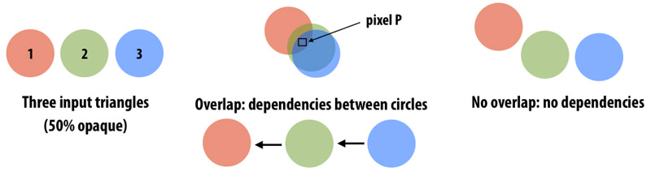
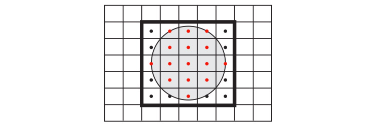
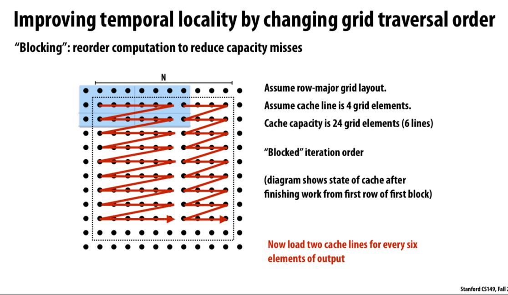

# Assignment 3: CUDA Renderer Implementations

## Overview
- Tiling
- Parallelism Between Pixels and Circle
- Using Shared Memory
- CUDA Memory Errors
- Minor CUDA-Specific Optimizations

## Tiling
The crux of this renderer implementation is the tiling method for allocating work. We do this by subdividing the entire image space into smaller sections which are larger than pixels but on a similar order of size as the circles being rendered.

The main benefit of tiling is that it exploits locality in updating the same pixel with multiple circles at once. This method also uses locality by grouping multiple adjacent tiles together to update subsections of the image at once.

A general overview of the algorithm using the tiling method is given below:

- Initialization
    1. Define the width of the tiles to be longer than the largest possible radius of the circles being rendered (this ensures that a circle covers at most 9 tiles)
    2. Initialize global arrays/structs for preprocessing of circles and pixels
- Circle updates
    1. Iterate over the circles and create an array mapping `circle index` to the tile where the circle's center lies --> returns index-to-tile array
    2. Sort this index-to-tile array by tile number (can be done with thrust::merge_sort for structs) --> returns tile-to-index array
    3. Run parallel prefix scan on the tile-to-index array to get list of tile-to-starting-index in the previous tile-to-index array (apply stream compaction algorithm 39.3.1 in https://developer.nvidia.com/gpugems/gpugems3/part-vi-gpu-computing/chapter-39-parallel-prefix-sum-scan-cuda) --> returns tile-to-starting-index array
- Pixel updates
    1. Iterate over the tiles in the image (two main ways to do this)
        - First way is the naive approach of iterating over the tiles by rows first then columns (similar to a standard )
        - Second way is to iterate over larger `n * n` sections of tiles, and then iterating over the tiles within each subsection. This method is more efficient since updating the pixels in one tile has dependencies on the 8 adjacent tiles, and iterating over the tiles in this pattern more optimally uses the cache with these dependencies.
    2. For ordering condition, need to find all circles which intersect with a particular tile (this is not just the circles with centers mapped to this tile!)
        - Need to iterate over the 8 adjacent tiles to consider every possible circle that intersects the specified tile
        - Then sort combined list of circle indices to process circle updates in order
    3. Launch kernel to update pixel values in the tile
        - First create shared memory (within the block) for all pixels of the tile
        - Iterate over sorted list of circle indices for the tile (as calculated above) and make the pixel updates in the proper order

<!--
This doesn't seem to be a good idea in implementation compared to the cache benefits of batch tiles launches

## Sorting of Tiles
The current proposed method of processing tiles is based on locality, by launching kernels on the batch set of tiles in an `n * n` subsection of tiles. However, some issues with this method, at least in certain scenarios, is the fact that the work is not necessarily evenly split over tiles in a subsection (for example, one tile in a subsection of tiles can have no circle intersections and thus no pixel updates, while a tile next to it could have a lot of circle updates).

With this in mind, one potential workaround is to sort the tiles by the total  -->

## Parallelism Between Pixels and Circle
**Assignment 3 Details:** "There are two potential axes of parallelism in this assignment. One axis is parallelism across pixels another is parallelism across circles (provided the ordering requirement is respected for overlapping circles). Solutions will need to exploit both types of parallelism, potentially at different parts of the computation."

1. First use parallelism across circles to assign circles to respective tiles covered
2. Use parallelism across pixels within each tile to reflect color changes of circles for each pixel in tile

Only parallelizing the code over circles, as done in the given render implementation, is not optimal since it results in multiple global updates to global memory before the final pixel attributes are set. Initially dividing out work for the circles across tiles and then iterating over the tiles to complete the work seems to be a more optimized approach to the render problem.

## Using Shared Memory and Cache Properties

We make use of shared memory primarily in the pixel update stage, where import color attributes of the circle and the pixels themselves can be stored on the shared memory and accessed much faster than constantly requesting data from main memory.

We make use of cache properties by processing tiles in batches, so the tiles closer together, with potential dependencies on each other, are updated together as well. Thus, this method results in less cache misses than naively iterating over the tiles in a sequential order by rows or by columns.

## CUDA Memory Errors
**Assignment 3 Details:** "For the tests which contain a larger number of circles - `rand1M` and `micro2M` - you should be careful about allocating temporary structures in global memory. If you allocate too much global memory, you will have used up all the memory on the device. If you are not checking the `cudaError_t` value that is returned from a call to `cudaMalloc`, then the program will still execute but you will not know that you ran out of device memory. Instead, you will fail the correctness check because you were not able to make your temporary structures. This is why we suggest you to use the CUDA API call wrapper below so you can wrap your `cudaMalloc` calls and produce an error when you run out of device memory."

**IMPORTANT:** Refer to *Catching CUDA Errors* section in Assignment 3 instructions
- Errors usually occur when too much memory is allocated on the device main memory
- In this case, it is essential to reduce the amount of code allocated 

## Minor CUDA-Specific Optimizations
Will add later (these optimizations come from suggestions made throughout the code files)

## Useful Diagrams
|  |
|:--:| 
| *Slide 28/51 in CS 149: Data-Parallel Thinking lecture, segmented scan* |

|  |
|:--:| 
| *Slide 41/51 in CS 149: Data-Parallel Thinking lecture, particle representations* |

|  |
|:--:| 
| *Slide 46/51 in CS 149: Data-Parallel Thinking lecture, data-parallel particle processing* |

|  |
|:--:| 
| *Assignment 3 instructions, pixel update dependencies based on circle order* |

|  |
|:--:| 
| *Assignment 3 instructions, pixel updates based on circle* |

|  |
|:--:|
| *Slide 43/69 in CS 149: Performance Optimization II lecture, temporal locality of grid traversal* |